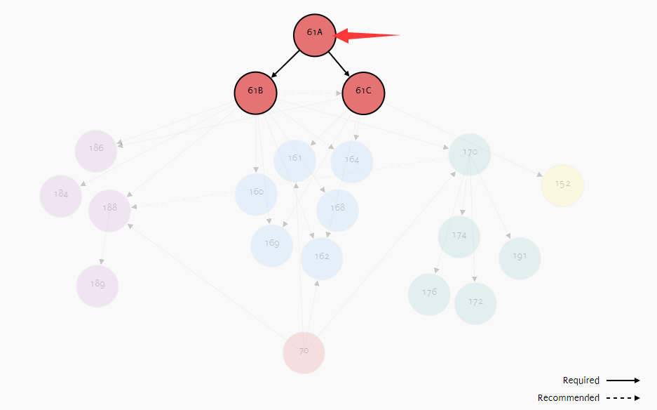

# === WARNING ===

DO NOT COPY OR PEEK CODE FROM THIS REPO, WHICH DEFINITELY WOULD BE CONSIDERED AS ACADEMIC DISHONESTY!

# Sources

HomePage of CS61a fa20: https://inst.eecs.berkeley.edu/~cs61a/fa20/

Where are we in Course Map?

# Issues

## Lab12 

the `sqlite_shell.py` in original zip file is empty, which results in the ok autograder is unable to run.

Solution: 
1. download zip file from [fa19](https://inst.eecs.berkeley.edu/~cs61a/fa19/lab/lab12/lab12.zip)
2. unzip the zip file you just download, for example, using command `unzip lab12.zip` in terminal.
3. replace the orignal `sqlite_shell.py` with the one with same name in newly unzipped folder.

## Lab13

Same issue with lab12.

Solution:
Simply copying `sqlite_shell.py` from hw09 to directory `/lab12` resolves this issue.
